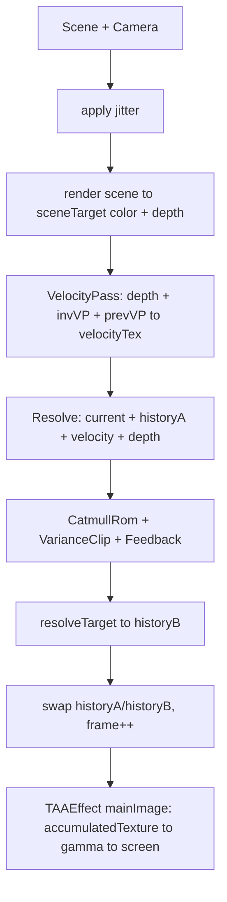

# Simple-TAA
Three.js 简单 TAA 示例。

## 实现流程

这套实现可以按下面这条线看：

1. `main.ts` 每帧调用 `composer.render()`。
2. `EffectPass(camera, taaEffect)` 触发 `TAAEffect.update()`。
3. `TAAEffect` 把参数传给 `TemporalReprojectPass`，再执行 `render()`。
4. `TemporalReprojectPass` 负责 jitter、当前帧渲染、速度图、历史融合和 history ping-pong。
5. `TAAEffect` 读取累计结果，做最终 gamma 输出。

---

### 1）渲染入口

```ts
const velocityPass = new VelocityPass();
const taaEffect = new TAAEffect(scene, camera, velocityPass);

const composer = new EffectComposer(renderer);
composer.addPass(new EffectPass(camera, taaEffect));
```

这里把 `TAAEffect` 挂进后处理管线，而不是单独手动调一个 pass。`VelocityPass` 没有直接进 composer，它由 `TAAEffect` 内部驱动。

```ts
const animate = (): void => {
  requestAnimationFrame(animate);
  controls.update();
  camera.updateProjectionMatrix();
  composer.render();
};
```

每帧真正触发 TAA 的入口就是 `composer.render()`。`controls.update()` 和 `camera.updateProjectionMatrix()` 保证当前帧相机状态是最新的，这会直接影响后面 velocity 计算和历史重投影坐标。

---

### 2）`TAAEffect`：参数桥接和最终输出

```ts
this.temporalReprojectPass.taaEnabled = this.taaEnabled;
this.temporalReprojectPass.blendFactor = this.blendFactor;
this.temporalReprojectPass.clipGamma = this.clipGamma;
this.temporalReprojectPass.jitterScale = this.jitterScale;
this.temporalReprojectPass.showVelocity = this.showVelocity;
this.temporalReprojectPass.showDiff = this.showDiff;
```

这段是参数桥接层：UI 改的是 `TAAEffect` 上的字段，真正参与 shader 计算的是 `TemporalReprojectPass` 上的字段。每帧同步一次可以保证参数改动立即生效。

```ts
this.temporalReprojectPass.render(renderer, inputBuffer ?? null, null);
this.uniforms.get('accumulatedTexture')!.value = this.temporalReprojectPass.texture;
```

第一行执行时域累积，第二行把累积结果绑定给 Effect 的采样纹理 `accumulatedTexture`，供最后输出阶段读取。

```glsl
vec3 color = texture2D(accumulatedTexture, uv).rgb;
color = pow(max(color, vec3(0.0)), vec3(1.0 / 2.2));
outputColor = vec4(color, 1.0);
```

这里做的事情很直接：从累积纹理采样，做一次 gamma 变换，再写屏幕。`max(color, 0)` 用来避免负值参与幂运算。

---

### 3）`TemporalReprojectPass` 每帧流程

看 `src/TemporalReprojectPass.ts` 的 `render()`。

#### TAA 关闭分支

```ts
if (!this.taaEnabled) {
  clearJitter(this.cameraRef);
  renderer.setRenderTarget(this.sceneTarget);
  renderer.clear(true, true, true);
  renderer.render(this.sceneRef, this.cameraRef);

  this.copyMat.uniforms.tDiffuse.value = this.sceneTarget.texture;
  this.blit(renderer, this.copyMat, this.resolveTarget);

  this.frame += 1;
  return;
}
```

关闭 TAA 时，不读 history，不算 velocity，只渲染当前帧。`clearJitter` 放在前面是为了避免上一帧残留的视口偏移污染当前直出结果。

#### TAA 开启分支

1. 计算当前帧 VP 和逆矩阵。
2. 应用 jitter。
3. 渲染当前帧 color + depth。
4. 清除 jitter。
5. 基于 depth 计算 velocity。
6. 用当前帧和历史帧做 resolve。
7. 把 resolve 结果复制到 historyB。
8. 交换 historyA/historyB。

```ts
this.currViewProj.multiplyMatrices(this.cameraRef.projectionMatrix, this.cameraRef.matrixWorldInverse);
this.invViewProj.copy(this.currViewProj).invert();

this.applyJitter();

renderer.setRenderTarget(this.sceneTarget);
renderer.clear(true, true, true);
renderer.render(this.sceneRef, this.cameraRef);

clearJitter(this.cameraRef);

const depthTexture = this.sceneTarget.depthTexture;
this.velocityPass.setFrameData(depthTexture, this.invViewProj, this.currViewProj);
this.velocityPass.render(renderer, null, null);

uniforms.tColor.value = this.sceneTarget.texture;
uniforms.tVelocity.value = this.velocityPass.texture;
uniforms.tDepth.value = depthTexture;
uniforms.tHistory.value = this.histA.texture;
this.blit(renderer, this.resolveMat, this.resolveTarget);

this.copyMat.uniforms.tDiffuse.value = this.resolveTarget.texture;
this.blit(renderer, this.copyMat, this.histB);

[this.histA, this.histB] = [this.histB, this.histA];
this.frame += 1;
```

这段里有三个关键点：

- `tHistory` 永远读 `histA`，本帧结果永远写 `histB`，最后交换引用，形成 ping-pong。
- `velocityPass` 用当前帧 depth + 当前/上一帧矩阵关系算重投影偏移。
- `frame += 1` 不只是计数，也影响 jitter 序列索引。

---

### 4）Jitter

```ts
const R2 = Array.from({ length: 256 }, (_, n) => [
  (BASE + A1 * n) % 1 - 0.5,
  (BASE + A2 * n) % 1 - 0.5,
]);
```

这里预生成了 256 组低差异采样点，分布比纯随机更均匀。`-0.5` 把范围平移到以 0 为中心，便于做正负方向偏移。

```ts
const [x, y] = R2[this.frame % R2.length];
this.cameraRef.setViewOffset(
  this.width,
  this.height,
  x * this.jitterScale,
  y * this.jitterScale,
  this.width,
  this.height,
);
```

`frame % R2.length` 让采样序列循环使用。`jitterScale` 是实际偏移幅度开关，调大能增强超采样效果，但也更依赖稳定的 history 约束。

```ts
function clearJitter(camera: PerspectiveCamera): void {
  camera.clearViewOffset();
}
```

每帧渲染完都要清除，否则后续相机使用会带着偏移继续跑，导致坐标体系不一致。

---

### 5）`VelocityPass`：由 depth 反推速度

```glsl
vec3 reconstructWorldPos(vec2 uv, float depth) {
  float z = depth * 2.0 - 1.0;
  vec4 clip = vec4(uv * 2.0 - 1.0, z, 1.0);
  vec4 wp = uInvViewProj * clip;
  return wp.xyz / wp.w;
}
```

这段做的是从屏幕空间反推世界坐标。输入是当前像素的 `uv + depth`，通过 `invViewProj` 回到世界空间，为“投到上一帧”做准备。

```glsl
float closestDepth = 1.0;
vec2 closestUV = vUv;

for (int x = -1; x <= 1; x++) {
  for (int y = -1; y <= 1; y++) {
    vec2 sUV = vUv + vec2(float(x), float(y)) * uInvTexSize;
    float d = texture2D(tDepth, sUV).r;
    if (d < closestDepth) {
      closestDepth = d;
      closestUV = sUV;
    }
  }
}
```

这里不是直接用中心像素深度，而是查 3×3 邻域最前面的深度点。边缘区域这么做通常更稳定，可以减轻前后景交界处的速度误判。

```glsl
vec3 wp = reconstructWorldPos(closestUV, closestDepth);
vec4 prevClip = uPrevViewProj * vec4(wp, 1.0);
vec2 prevUV = prevClip.xy / prevClip.w * 0.5 + 0.5;
vec2 velocity = closestUV - prevUV;
gl_FragColor = vec4(velocity, 0.0, 1.0);
```

同一个世界点在上一帧的屏幕位置是 `prevUV`，当前帧位置是 `closestUV`，两者差值就是 motion vector。

---

### 6）Resolve Shader：时域融合与抗鬼影

对应 `TemporalReprojectPass.ts` 里的 `createResolveMaterial().fragmentShader`。

```glsl
vec2 historyUV = vUv - velocity;
if (historyUV.x < 0.0 || historyUV.x > 1.0 || historyUV.y < 0.0 || historyUV.y > 1.0) {
  gl_FragColor = vec4(currentColor, 1.0);
  return;
}
```

先根据 velocity 找到历史帧采样位置。越界时直接退化为当前帧，避免读到非法区域导致拖影。

```glsl
vec3 historyColor = BiCubicCatmullRom5Tap(tHistory, historyUV, uInvTexSize).rgb;
```

历史采样用 Catmull-Rom 5 tap，不是单点采样。这样历史重建更平滑，细节保留也更好。

```glsl
vec3 mu = m1 / 9.0;
vec3 sigma = sqrt(abs(m2 / 9.0 - mu * mu));
vec3 cMin = mu - uClipGamma * sigma;
vec3 cMax = mu + uClipGamma * sigma;
vec3 clippedHistoryTonemappedYCoCg = ClipAABBToCenter(historyTonemappedYCoCg, cMin, cMax);
```


在做统计裁剪前，shader 还做了两步颜色预处理：

- 先做 `ToneMapSimple`，把过亮值压缩到更稳定的范围，降低高亮像素对均值/方差的干扰。
- 再做 `RGB -> YCoCg`，把亮度（Y）和色度（Co/Cg）拆开，裁剪时可以对亮度和色度分别处理。

`YCoCg` 可以理解为一种便于做时域稳定处理的颜色空间：

- `Y` 近似亮度分量，最影响闪烁感；
- `Co/Cg` 是色差信息，通常变化幅度比亮度小。

本项目在裁剪时会额外收紧色度范围（`cMin.yz / cMax.yz` 按 `chromaExtent` 限制），这样做的目的，是避免历史颜色在色彩方向漂得太远，减少彩边和色偏鬼影。

裁剪结束后，再通过 `YCoCg -> RGB` 和 `UnToneMapSimple` 回到用于最终混合的颜色空间。

```glsl
float diff = abs(lum0 - lum1) / max(lum0, max(lum1, 0.2));
float w = 1.0 - diff;
float kFeedback = mix(1.0 - uBlendFactor * 2.0, 1.0 - uBlendFactor * 0.5, w * w);
vec3 result = mix(currentColor, historyColor, kFeedback);
```

最后做自适应混合：当前帧和历史帧亮度越接近，`kFeedback` 越大，历史权重越高；差异越大，系统越偏向当前帧，降低错误历史的影响。

---

### 7）资源生命周期：初始化 / resize / reset

```ts
this.sceneTarget = new WebGLRenderTarget(width, height, {
  minFilter: LinearFilter,
  magFilter: LinearFilter,
  type: HalfFloatType,
  depthTexture: depthTex,
});

this.histA = new WebGLRenderTarget(width, height, historyOptions);
this.histB = new WebGLRenderTarget(width, height, historyOptions);
this.resolveTarget = new WebGLRenderTarget(width, height, {
  minFilter: LinearFilter,
  magFilter: LinearFilter,
  type: HalfFloatType,
});

this.velocityPass.setSize(width, height);
this.frame = 0;
```

`sceneTarget` 同时存 color 和 depth。`histA/histB` 存时域历史。`resolveTarget` 存本帧融合结果。尺寸变化时整套 RT 会重建，并把 `frame` 归零，防止旧历史跨分辨率污染新帧。

```ts
window.addEventListener('resize', () => {
  camera.aspect = width / height;
  camera.updateProjectionMatrix();
  renderer.setSize(width, height);
  composer.setSize(width, height);
});
```

窗口变化时，这里会把相机、renderer、composer 一起更新。最终会传导到 `TemporalReprojectPass.setSize()`，保持纹理尺寸一致。

```ts
reset(): void {
  this.frame = 0;
  this.velocityPass.reset();
}
```

重置 history 时，不只清帧号，也清 velocity 历史矩阵状态。这样切换参数或镜头突变后能更快回到稳定状态。

---

### 8）UI 参数与效果对应

| 参数 | 字段 | 作用 |
|---|---|---|
| Enable TAA | `taaEnabled` | 开关历史融合，关闭后退化为当前帧直出 |
| Blend Factor | `blendFactor` | 控制历史反馈强度，越大越偏向当前帧 |
| Variance Clip Gamma | `clipGamma` | 控制历史裁剪宽度，越小越严格 |
| Jitter Scale | `jitterScale` | 控制亚像素抖动幅度 |
| Show Motion Vectors | `showVelocity` | 显示速度图调试视图 |
| Show History Diff | `showDiff` | 显示当前帧与历史帧差异 |

---

### 9）一帧数据流



```text
Scene + Camera
  ├─ apply jitter
  ├─ render current color+depth -> sceneTarget
  ├─ depth + matrix -> VelocityPass -> velocityTex
  ├─ Resolve(current, historyA, velocity, depth)
  │    └─ CatmullRom + VarianceClip + Feedback
  ├─ resolveTarget -> copy -> historyB
  └─ swap(historyA, historyB), frame++

TAAEffect(mainImage): accumulatedTexture -> gamma -> screen
```

---

## Reference
- [TAA tutorial](https://docs.google.com/document/d/15z2Vp-24S69jiZnxqSHb9dX-A-o4n3tYiPQOCRkCt5Q/edit#)
- [Temporal AA Anti-Flicker](https://zhuanlan.zhihu.com/p/71173025)
- [HIGH-QUALITY TEMPORAL SUPERSAMPLING - Brian Karis (Epic Games, Inc.)](http://advances.realtimerendering.com/s2014/#_HIGH-QUALITY_TEMPORAL_SUPERSAMPLING)
- [An Excursion in Temporal Supersampling - NVDIA](https://developer.download.nvidia.cn/gameworks/events/GDC2016/msalvi_temporal_supersampling.pdf)
- [Temporal Reprojection Anti-Aliasing in INSIDE](http://twvideo01.ubm-us.net/o1/vault/gdc2016/Presentations/Pedersen_LasseJonFuglsang_TemporalReprojectionAntiAliasing.pdf)
